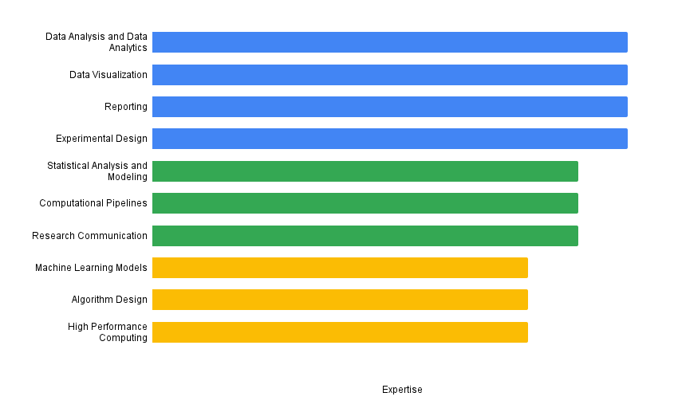

My name is Victoria McCray, and I'm currently a Master of Science Candidate in Bioinformatics at Northeastern University. I earned my Bachelor of Science in Psychology (Honors) with a minor in Data Science from Northeastern University. 

My research interests lie in computational methods and techniques in cognitive neuroscience and neuroimaging disciplines. I am currently a Masters of Science Candidate in Bioinformatics and have experience conducting data analysis, building computational pipelines, and providing advanced analytics. I have experience in data management, statistical analysis, and
software development. I hope to contribute computational techniques that improve the efficacy of treatment in neuropsychiatric disorders. I have also dedicated my work to diversity and inclusion in the neuroscience field, and I have shown a record of awards and honors for my achievements and service.

View my CV [here](assets/img/victoriamccray-cv.pdf).

<h2 align="center">Skills</h2>

### I am currently...

- MSc Candidate in Bioinformatics
- Finance Director at Black In Neuro
