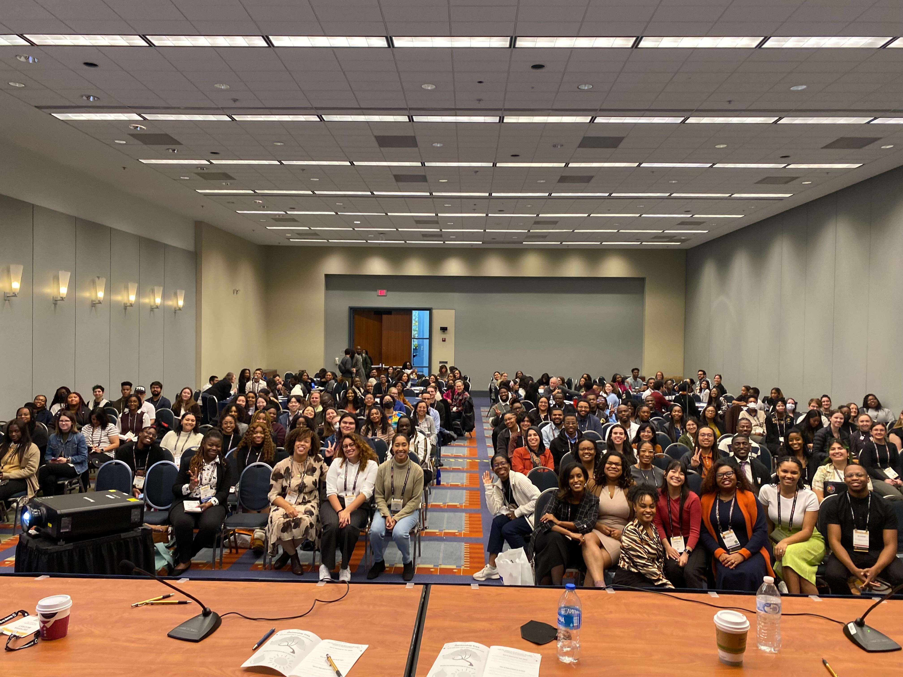

I have 5+ years experience conducting research and data analysis. I have 3+ years experience as an Analyst in User and Market Research for medical device, product development, and marketing domains. I have experience conducting computational analyses for neuroimaging and biomedical data. I completed my thesis in the Learning and Brain Development Lab (LBDL) at Northeastern University by implementing functional connectivity analysis with clinical data. For my experience as a research assistant, I provided data collection and preprocessing in cognitive psychology and psychophysiology labs. In 2021, I joined the grassroots organization Black In Neuro where I developed community programming, communications and reporting, and I now serve on the Board of Directors for the non-profit as Director of Finance following the incorporation of the organization as a non-profit.

Level of interest in my previous work and roles

- I rock a great mustache
- I'm extremely loyal to my family

What else do you need?

## Black In Neuro

Black In Neuro is a grassroots organization dedicated to providing resources, building community, and celebrating the contributions of black individuals in the neuroscience fields.I currently serve on the Board of Directors for the non-profit Black In Neuro where I oversee financial planning and reporting for the organization.

### SfN 2023

Black In Neuro collaborated with Society for Neuroscience (SfN) to provide a professional development workshop available to SfN attendees. Along with Drs. Angeline Dukes, De-Shaine Murray, Clíona Kelly, Elena Dominguez, Rackeb Tesfaye, and Christine Liu. I collaborated to develop the workshop program, materials, and agenda for the SfN 2023 Conference. The workshop was attended in-person by 200+ individuals of varying personal, educational, and geographic backgrounds.

Professional Workshop Title: How I Survived Grad School: Perspectives from Black In Neuro

*The workshop was developed and facilitated by the Black In Neuro team*

*The workshop was attended in-person by 200+ individuals at SfN*

Funders and Partners: Society for Neuroscience

### Ernest E. Just Society

With several other grassroots organizations dedicated to impacting black individuals in STEM fields (collectively known as BlackInX), Black In Neuro was honored at the Smithsonian National Museum of African American History and Culture in Washington D.C. on Sep. 16, 2023.

Funders and Partners: United Negro College Fund, Ernest E. Just Society
Awards: Black In Neuro organizers were awarded for Leadership and Service.

## Learning and Brain Development Lab

The Learning and Brain Development Lab (LBDL) investigates the development of value processing, motivation, and learning across the lifespan at Northeastern University. I completed my undergraduate honors thesis in the LBDL with Dr. Juliet Davidow, and I received the Paul and Grace Ward Martinez (‘48) Research Fellowship to support my research.

My honors thesis leveraged a behavioral reward paradigm and functional magnetic resonance imaging (fMRI) data to assess reward sensitivity and functional connectivity of reward networks for individuals living with schizophrenia and comorbid cannabis use disorder. The study provided the experimental administration of cannabis to patient participants. Participants completed a behavioral reward task then a resting-state fMRI scan before and after cannabis use. 

The open-source software for connectivity analyses, CONN, was developed by thesis second reader Dr. Susan Whitfield-Gabrieli and Neuroimaging Tools and Resources Collaboratory (NITRC). I presented the findings of my thesis at the Research, Innovation, and Scholarship Expo (RISE) in Boston, MA, USA.

*My work was awarded with the Avrom Aaron Level Memorial Award; pictured is Victoria (left) and Dr. Juliet Davidow (right)*

Funders and Partners: Paul and Grace Ward Martinez, NITRC
Awards: Avrom Aaron Leve Memorial Award

