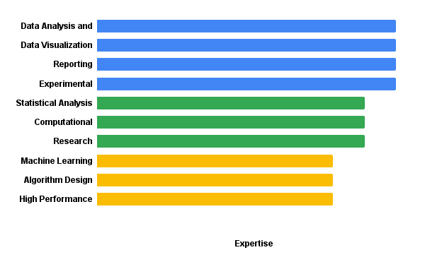

I have 5+ years experience conducting research and data analysis. I have 3+ years experience as an Analyst in User and Market Research for medical device, product development, and marketing domains. I have experience conducting computational analyses for neuroimaging and biomedical data. I completed my thesis in the Learning and Brain Development Lab (LBDL) at Northeastern University by implementing functional connectivity analysis with clinical data. For my experience as a research assistant, I provided data collection and preprocessing in cognitive psychology and psychophysiology labs. In 2021, I joined the grassroots organization Black In Neuro where I developed community programming, communications and reporting, and I now serve on the Board of Directors for the non-profit as Director of Finance following the incorporation of the organization as a non-profit.

## Skills

Level of interest in my previous work and roles

- I rock a great mustache
- I'm extremely loyal to my family

What else do you need?

### My story

To be honest, I'm having some trouble remembering right now, so why don't you just watch [my movie](https://en.wikipedia.org/wiki/The_Princess_Bride_%28film%29) and it will answer **all** your questions.
