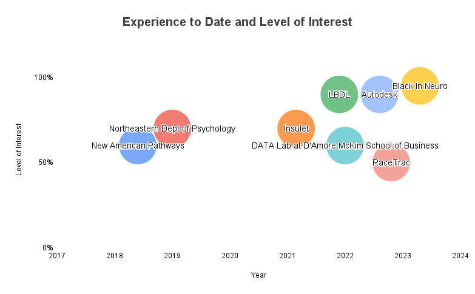

I have 5+ years experience conducting research and data analysis. I have 3+ years experience as an Analyst in User and Market Research for medical device, product development, and marketing domains. I have experience conducting computational analyses for neuroimaging and biomedical data. I completed my thesis in the Learning and Brain Development Lab (LBDL) at Northeastern University by implementing functional connectivity analysis with clinical data. For my experience as a research assistant, I provided data collection and preprocessing in cognitive psychology and psychophysiology labs. In 2021, I joined the grassroots organization Black In Neuro where I developed community programming, communications and reporting, and I now serve on the Board of Directors for the non-profit as Director of Finance following the incorporation of the organization as a non-profit.

Level of interest in my previous work and roles

- I rock a great mustache
- I'm extremely loyal to my family

What else do you need?

## Black In Neuro

Black In Neuro is a grassroots organization dedicated to providing resources, building community, and celebrating the contributions of black individuals in the neuroscience fields.I currently serve on the Board of Directors for the non-profit Black In Neuro where I oversee financial planning and reporting for the organization.

### SfN 2023

Black In Neuro collaborated with Society for Neuroscience (SfN) to provide a professional development workshop available to SfN attendees. Along with Drs. Angeline Dukes, De-Shaine Murray, Clíona Kelly, Elena Dominguez and Rackeb Tesfaye, I collaborated to develop the workshop program, materials, and agenda for the SfN 2023 Conference. The workshop was attended in-person by 200+ individuals of varying personal, educational, and geographic backgrounds.

Professional Workshop Title: How I Survived Grad School: Perspectives from Black In Neuro

*The workshop was attended in-person by 200+ individuals at SfN*
[PICTURE]

Funders and Partners: Society for Neuroscience

