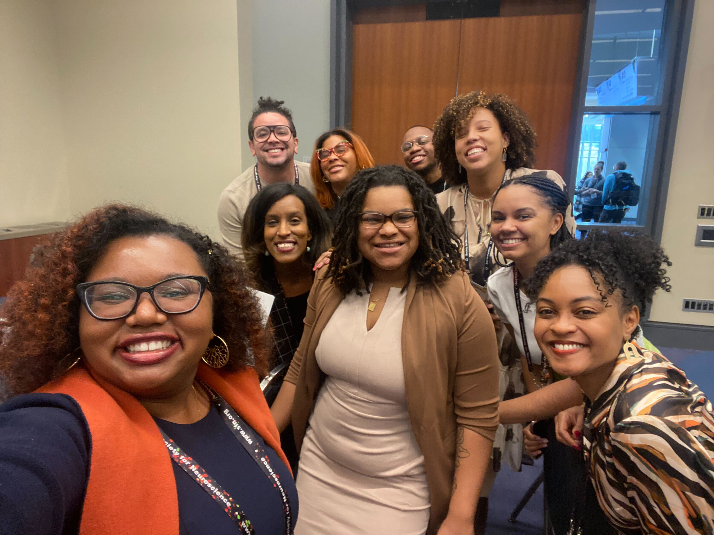

I have over five years of progressive experience in advanced analytics and research across healthcare, life sciences, and technology sectors. In my current role as a health data scientist supporting federal public health initiatives, I develop data quality pipelines and statistical analyses for national surveillance systems, leading technical development of analytics frameworks and serving as a subject matter expert in Python and R programming for cross-functional teams of behavioral scientists, epidemiologists, neurologists, and data engineers. Previously, I conducted user research and product analytics in medical device development and technology product optimization, where I performed advanced statistical modeling including regression, cluster analysis, and hypothesis testing on large-scale datasets. My computational research background includes functional connectivity analysis of clinical neuroimaging data, as well as data collection, preprocessing, and statistical analysis in cognitive psychology and psychophysiology research at university laboratories. I also serve on the leadership team for Black In Neuro, a grassroots non-profit organization focused on supporting Black trainees in neuroscience, where I oversee financial planning and reporting.

*Visualization of my professional experience over time and my interest*

Below are the organizations from my previous experience for more details.

<h2 align="center">Guidehouse Health</h2>

I joined Guidehouse as a Data Scientist on the Health Data Science and Analytics team in February 2024. Guidehouse provides consulting to public health, private sector, state and federal health agencies. As a consultant in the Guidehouse Health segment, my work focuses on the delivery of informatics solutions for life science domains.

<h3 align="center">Supporting the CDC</h3>

Guidehouse Health (2024-Present)

Health Data Scientist | Public Health Advisory | AI & Data Science Technology

With the Centers for Disease Control and Prevention (CDC), I developed statistical pipelines and data quality frameworks for large-scale public health surveillance systems. I led technical documentation, implemented automated processing workflows, and conducted epidemiological analyses supporting federal health initiatives.

**Key Contributions:**
- Architected data quality control systems processing 11M+ records
- Authored standard operating procedures for cross-functional 
  scientific teams
- Developed statistical modeling pipelines for prevalence estimation
- Created analytics for public-facing dashboards of federal programs

Technical Stack: PySpark, Python, R, SQL, Databricks, Snowflake, 
Power BI, GitHub

[View CDC Public Dashboard](https://www.cdc.gov/overdose-prevention/data-research/facts-stats/dose-dashboard-nonfatal-discharge-data.html)
<h2 align="center">Black In Neuro</h2>

Black In Neuro is a grassroots organization dedicated to providing resources, building community, and celebrating the contributions of black individuals in the neuroscience fields. I currently serve on the Board of Directors for the non-profit Black In Neuro where I oversee financial planning and reporting for the organization.

### SfN 2023

Black In Neuro collaborated with Society for Neuroscience (SfN) to provide a professional development workshop and community social available to SfN attendees. Along with Drs. Angeline Dukes, De-Shaine Murray, Clíona Kelly, Elena Dominguez, Rackeb Tesfaye, and Christine Liu, I collaborated to develop the workshop program, materials, and agenda for the SfN 2023 Conference. The workshop was attended in-person by 200+ individuals of varying personal, educational, and geographic backgrounds.

**Professional Development Workshop**

How I Survived Grad School: Perspectives from Black In Neuro

*The workshop was developed and facilitated by the Black In Neuro team*

*The workshop was attended in-person by 200+ individuals at SfN*

Funding and Partners: Society for Neuroscience

### Ernest E. Just Society

The Ernest E. Just Society is dedicated to acknowledging the work of African Americans in the life science fields. With several other grassroots organizations dedicated to impacting black individuals in STEM fields (collectively known as BlackInX), Black In Neuro was honored at the Smithsonian National Museum of African American History and Culture in Washington D.C. on Sep. 16, 2023.

*I joined the planning committee meeting for the inaugural EE Just Conference along with other Leadership representatives from Black In Neuro and Black In X*

*Black In Neuro was honored at the Smithsonian in Washington, D.C., USA*

Funding and Partners: United Negro College Fund, Ernest E. Just Society

Awards: Black In Neuro was awarded for Leadership and Service

<h2 align="center">Learning and Brain Development Lab</h2>

The Learning and Brain Development Lab (LBDL) investigates the development of value processing, motivation, and learning across the lifespan at Northeastern University. I completed my undergraduate honors thesis in the LBDL with Dr. Juliet Davidow, and I received the Paul and Grace Ward Martinez (‘48) Research Fellowship to support my research.

My honors thesis leveraged a behavioral reward paradigm and functional magnetic resonance imaging (fMRI) data to assess reward sensitivity and functional connectivity of reward networks for individuals living with schizophrenia and comorbid cannabis use disorder. The study provided the experimental administration of cannabis to patient participants. Participants completed a behavioral reward task then a resting-state fMRI scan before and after cannabis use. 

The open-source software for connectivity analyses, CONN, was developed by thesis second reader Dr. Susan Whitfield-Gabrieli and Neuroimaging Tools and Resources Collaboratory (NITRC). I presented the findings of my thesis at the Research, Innovation, and Scholarship Expo (RISE) in Boston, MA, USA.

*My work was awarded with the Avrom Aaron Leve Memorial Award; pictured is myself, Victoria (left) and Dr. Juliet Davidow (right)*

Funding and Partners: Paul and Grace Ward Martinez, NITRC

Awards: Avrom Aaron Leve Memorial Award

Tools: Python (Jupyter Notebooks, scikit-learn, matplotlib), R (EZ, R Studio, R Markdown)

<h2 align="center">Autodesk</h2>

I worked as a contractor in Product Development and Manufacturing Solutions on the Experience Design Research team; my role was dedicated to improving user experience for design software products such as Inventor, Fusion, Vault, and more. I worked closely with user researchers, data analysts, data scientists, and cross-functional product teams. From my experience as an Analyst, I implemented statistical techniques to develop personalization for users.

Inventor is a CAD software application used by mechanical engineers, product designers, and developers to build and automate 3D designs. For my role at Autodesk, I conducted user interviews to create new user personas. I created product usage analytics and custom dashboards to understand how users interact with the product. I also created insight reports to inform product planning and partnered with researchers and data analysts to inform the product roadmap of user perspectives. See one of my project approaches for the Inventor product below.

**Requirements:**
- Assess a change in loyalty metrics performance for Inventor
- Provide insights to most prevalent reasons for the change
  
*I leveraged several methods to provide comprehensive insights*

**Outcomes:**
- Provided diagnostic analysis and recommendations to cross-functional product team
- Informed strategic initiatives and product roadmap planning
- Partnered with product team to assess feature gaps

For my role with Autodesk, I also attended the OOUX Workshop with other subject matter experts and cross-functional teams in order to build user-driven, object-oriented, solutions for innovation within the organization. The workshop was held in Boston, MA, USA.

Tools: Qualtrics XM, Looker, SQL, Python

<h2 align="center">Insulet</h2>

In 2021, Insulet launched the automated insulin mobile delivery system and application, Omnipod 5 to integrate with glucose monitors and the delivery system.

For my co-op as a user experience researcher with Insulet, I conducted formative and summative research with the expertise of the UX Research team dedicated to the automated insulin delivery experience for folks with Type I and Type II Diabetes. I was able to collaborate with human factors engineers to test usability of the wearable medical device using the Omnipod 5 automated insulin mobile application for delivery. During my time, I also helped establish the practice of usability metrics including ease of use, satisfaction, success rate and time on task to build product recommendations.

**Requirements:**
- Implement usability metrics to assess the success of prototypes
- Provide recommendations to the cross-functional team including designers, engineers, and clinical teams

  
**Outcomes:**
- Provided understanding of the efficacy of applications among users with lived experience of Type I and Type II diabetes
- Contributed to the successful launch of a system integrated with multiple external medical devices
- Communicated team findings to a wide organizational audience and strengthened trust in user research

Tools: Qualtrics, UserZoom, Airtable

<h2 align="center">Research Assistantships at Northeastern University</h2>

### Department of Psychology

Research Assistant, Language and Mind Lab

Principal Investigator: Dr. Iris Berent

Tools: MATLAB

Research Assistant, Interdisciplinary Affective Science Lab

Principal Investigator: Dr. Lisa Feldman-Barrett

Tools: Mindware

### D’Amore-McKim School of Business
Market Research Assistant, DATA (Digital, Analytics, Technology and Automation) Research Lab

Principal Investigator: Yakov Bart

Tools: Kantar, Excel

