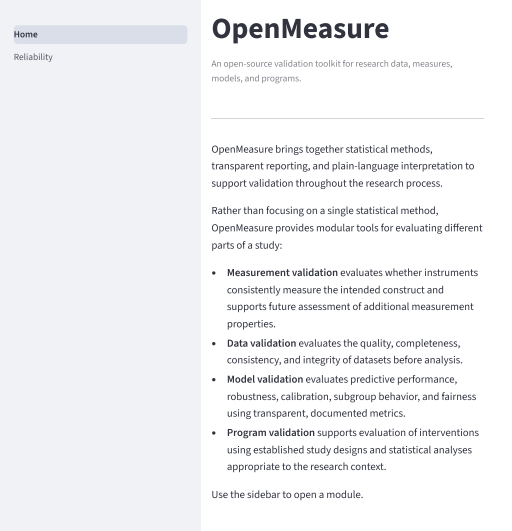

OpenMeasure brings together statistical methods, transparent reporting, and plain-language interpretation to help researchers evaluate measurements, datasets, analytical models, and program evaluations.

OpenMeasure is designed for researchers and practitioners working in community health, social services, education, public policy, and applied research. The toolkit emphasizes validation methods that are accessible, reproducible, transparent, and adaptable across disciplines.


## Live Application

[https://openmeasure.streamlit.app](https://openmeasure.streamlit.app)

## Modules

### Measurement Validation

Evaluates the consistency and quality of research instruments and supports future assessment of additional measurement properties.

**Available:** Reliability v0.1

### Data Validation

Evaluates data quality, completeness, consistency, and integrity before analysis.

**Status:** Under Development

### Model Validation

Evaluates predictive performance, robustness, calibration, subgroup behavior, and fairness using transparent, documented metrics.

OpenMeasure does not prescribe a single definition of fairness. Future modules will present multiple established metrics alongside their assumptions, tradeoffs, and ethical considerations.

**Available:** Fairness v0.05

### Program Validation

Supports evaluation of interventions using research designs and statistical methods appropriate to the program, population, and evaluation goals.

**Available:** Program Evaluation v0.1

## Design principles

Each module follows these principles:

- Transparent statistical methods
- Reproducible analyses
- Explicit assumptions and limitations
- Plain-language interpretation
- Documented references
- Responsible use aligned with research and professional ethics

## Quickstart

```bash
git clone https://github.com/victoriamccray/openmeasure.git
cd openmeasure
pip install -r requirements.txt
streamlit run Home.py
```

## Repository structure

```
openmeasure/
├── Home.py
├── pages/
│   └── 1_Reliability.py
├── modules/
│   ├── reliability/
│   │   ├── README.md
│   │   ├── core/
│   │   ├── tests/
│   │   └── sample_data/
│   ├── fairness/
│   │   └── README.md
│   └── program_evaluation/
│       └── README.md
├── shared/
│   └── report.py
├── docs/
│   └── design-standards.md
└── requirements.txt
```

Each module documents its methods, assumptions, limitations, references,
and intended use. Shared design standards keep reporting, interpretation,
and presentation consistent across the toolkit.


## Current release
### Reliability v0.1

The first public release includes:

- Cronbach's alpha
- Corrected item-total correlations
- Alpha if item dropped
- Odd-even split-half reliability
- Spearman-Brown correction
- Listwise missing-data handling
- Plain-language interpretation
- Assumptions and limitations
- 24 passing unit tests

See `modules/reliability/README.md` for methodology and references.

Future releases will expand OpenMeasure with data validation, model validation, and program evaluation modules.

### User Interface

The Reliability module provides an interactive workflow for data upload,
reliability analysis, interpretation, and transparent reporting.

### Home



### Reliability Analysis


### Assumptions & Limitations


### Fairness Goals


## Running tests

```bash
pip install pytest
pytest modules/reliability/tests/ -v
```

## Contributing

OpenMeasure is an early-stage project. Researchers, clinicians, technologists, and evaluators are welcome to contribute.

Please open an issue before submitting a pull request so proposed changes can be discussed and aligned with the project's scope and design principles.

## GitHub Repository
[](https://github.com/victoriamccray/openmeasure)

## License
[](https://github.com/victoriamccray/openmeasure/blob/main/LICENSE)

See `LICENSE.md`.

# Authorship

OpenMeasure was created and is maintained by **Victoria McCray**. Contributions are welcome (see `CONTRIBUTING.md`). Portions of the codebase were developed with the assistance of generative AI tools for code drafting, debugging, and documentation. All statistical methods were independently verified, and all design and implementation decisions were made by the project author.
